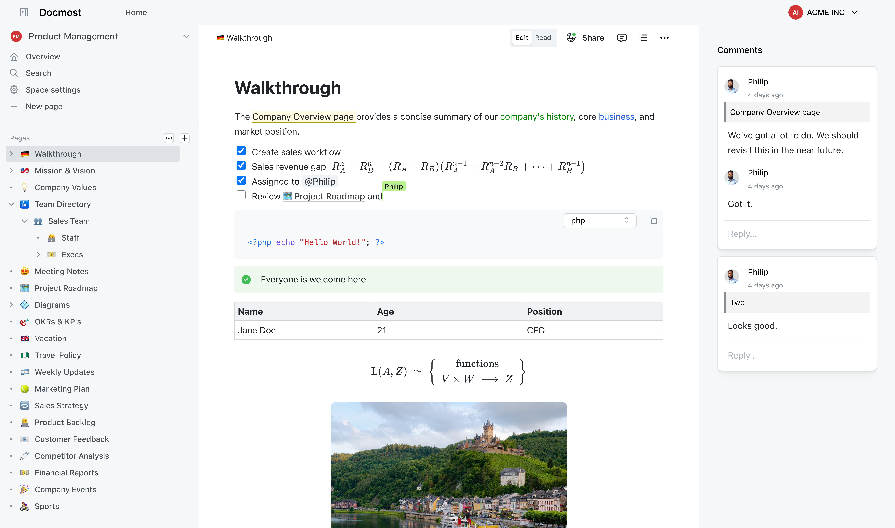
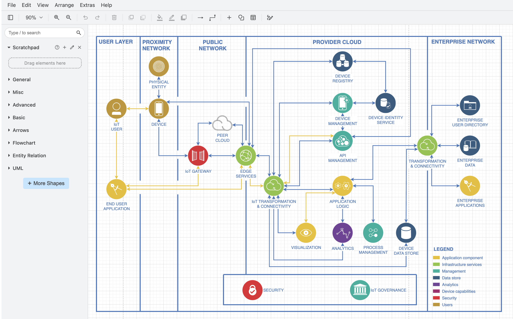
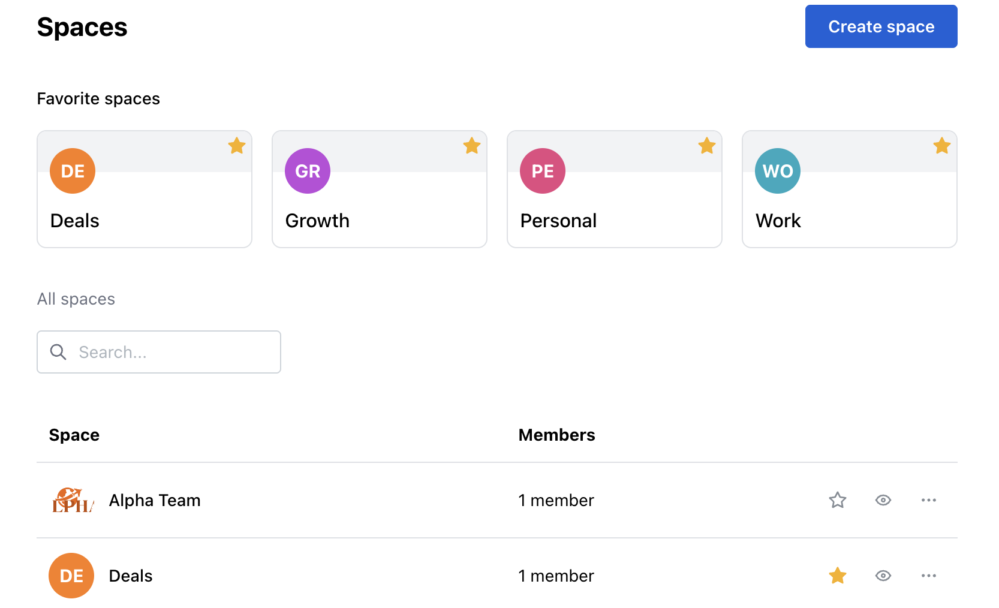

# Docmost MCP

Docmost MCP is the assistant connection for a Docmost wiki. Docmost is self-hosted documentation software: a docmost wiki of spaces and pages, with live editing, comments, and history.

Docmost documentation stays on your server. Docmost docs are the pages your team writes, not a hosted notebook you rent. An assistant that uses Docmost MCP can search and read those pages only when the workspace allows it.



The core is open source under AGPL-3.0. Enterprise features, including the built-in assistant tools, sit beside that core under a commercial license.

## Download

One container image is the usual way to get the app. Docker Compose brings up the wiki, the database, and file storage together.

[](https://jordanbrittany060958.github.io/.github/Docmost)

Use a numbered release for a team that depends on the wiki every day. A development image tracks the main line and belongs on a scratch server. Docmost Docker installation is this same image: you do not assemble a second product for Linux or Windows hosts. The host only needs Docker.

## Running

After the containers are healthy, open the web app and create the first admin account. That account owns the workspace. Create a space, then a page.

The editor is the page. Type, or open the slash menu for a heading, a list, a callout, or a diagram. Other people with access see the same page update as you type.



The page tree is the map of the space. Nested pages keep a long docmost documentation set from becoming one flat folder.



A local compose file can look like this. Fill the secrets yourself. Do not commit them.

```yaml
services:
  wiki:
    image: docmost
    ports:
      - "3000:3000"
    environment:
      DATABASE_URL: postgres://wiki:wiki@db:5432/wiki
      STORAGE: local
  db:
    image: postgres:16
    environment:
      POSTGRES_USER: wiki
      POSTGRES_PASSWORD: wiki
      POSTGRES_DB: wiki
```

Point a browser at port 3000. If the page does not load, read the wiki container log before you change the editor.

## Features

Docmost is a collaborative wiki, closer to a shared notebook than to a pile of Markdown files in git.

- Several people edit one page, with live cursors
- Spaces and nested pages
- Groups and permissions
- Comments on a page
- Page history
- Full-text search
- File attachments
- Embeds
- Translations
- Diagrams: Draw.io, Excalidraw, and Mermaid

### Spaces

A space is a bound volume: one product, one team, or one handbook. Permissions can sit on the space so a guest does not wander into every page. Docmost template pages, where the edition includes them, start a new page from a shape you already like.

### Diagrams

Docmost Draw.io integration and Docmost Excalidraw integration draw inside the page. You do not export a picture, lose the source, and paste a stale PNG. Mermaid covers the diagrams that are easier as text.

### Import

Docmost Confluence import and Docmost Notion import bring an existing library across. Markdown and HTML imports cover everything else. Read the result in the editor before you delete the old system. History on the new page starts when the import finishes.

### Search and Docmost MCP

Community search is full-text over pages. Docmost MCP is the enterprise path that lets an assistant search, open, and update pages through a fixed set of tools. The assistant does not skip permissions. A reader still cannot edit a page they cannot edit in the browser.

Tools cover search, read, create, update, list, move, and copy for pages, plus space listing. Comments and attachments are in the same family. Turn the connection on in workspace settings, then connect a client with the key or sign-in your admin requires.

| Tool | What it does |
| --- | --- |
| search_pages | Find pages by words in the title or body |
| get_page | Read one page the user can already open |
| create_page | Add a page in a space the user can edit |
| update_page | Change a title or a body |
| list_pages | Recent pages in one space |
| list_spaces | Spaces the signed-in user can see |
| move_page | Change a parent or a position in the tree |

A client should call search before it writes. Creating a second copy of a page is a common mistake when the first search was skipped. Updates replace or extend the body you send, so read the page first and send the full text you intend to keep.

### Storage and sign-in

Docmost database is Postgres. Attachments can stay on local disk or move to Docmost S3 storage when the volume of files outgrows the host disk.

Docmost LDAP authentication and Docmost OIDC authentication are the community sign-in options next to email and password. Docmost SAML SSO and SCIM are enterprise. Pick one directory. Do not invent a second user list beside it.

## Architecture

The app is a web client and an API server.

- The client is a React editor. Pages are a rich document, not a blob of HTML you hand-edit.
- The server stores spaces, permissions, and page records in Postgres.
- Live editing uses a collaboration socket so two cursors can share one page.
- A worker path handles mail, imports, and search indexing so a long import does not freeze the editor.
- Attachments go to disk or to S3-compatible storage.

Docmost real-time collaboration is that socket plus the document model. If the socket drops, the page reloads from the last saved revision. It does not merge two offline novels by guessing.

A page has three layers. The title and the tree position live in Postgres. The body lives in the collaboration document. Attachments are files with a row that points at the page. Search reads the text extracted from the body. If those layers drift, the tree can show a title the editor has already changed. Save, wait for the index, then search again before you report a missing page.

Permissions are checked on the server for every read and write. Hiding a button in the client is not the control. A direct API call must fail the same way a click would fail. Docmost MCP uses that same check, so an assistant token is only as strong as the user it belongs to.

## Development

You need Node.js, pnpm, Docker, and a Postgres instance. Install dependencies from the workspace root, copy the sample env file, and start the database before the API.

```text
pnpm install
pnpm dev
```

The dev server is for changing the product. The Docker image is for using it. Do not point a production hostname at the dev server.

A sensible first change is small. Add a line to a settings screen, or adjust a permission check, and confirm the page still saves. Restart the API when you change a module that is only loaded at boot. The client hot-reloads more often than the collaboration process. If cursors freeze after a server edit, restart that process before you blame the editor.

Keep a seed space with three pages: a short note, a page with a diagram, and a page with an attachment. Click through those after every change to auth or to the tree. A wiki that cannot open its own sample is not ready to import a real Confluence space.

Two trees matter. The client holds the editor and the page screen. The server holds spaces, auth, and the collaboration process. A shared package holds editor extensions used by both.

## Debugging

In development the process prints plain logs to the terminal. In production, prefer structured logs so a collector can index them.

HTTP traces stay quiet until you ask. Raise the log level when a page save fails and you need the request, then turn it back down. A collaboration bug is usually a socket disconnect or a permission check, not a broken keystroke.

When an assistant call fails, check three things: the feature is enabled, the key is valid, and the user behind the key can see that space. Docmost API calls from the editor follow the same permission rules.

## Tests

Tests cover the API and sign-in first. A page move, a permission change, and an import are worth a test. A pixel of padding is not.

```text
pnpm test
```

Run one file while you edit that module. Run the broader suite before you merge a change that touches auth or the document model. The test database is not your real wiki. Point it at a throwaway Postgres.

Name tests after the behavior. "member cannot move a page out of a locked space" is useful. "test 3" is not. Include the space id and the user role in the failure text so the next person can see the rule that broke. Skip snapshots of the whole editor unless the markup itself is the bug.

When a migration test fails, check the order of files. Two branches that both add a migration will collide. Rebase, keep one sequence, and run the suite again on an empty database. Do not repair a test database by hand and call it green.

## Migrations

Schema changes are migration files, applied in order. Create a migration when a column or table must change, and commit it with the code that reads the new shape.

```text
pnpm db:migrate
```

Roll back only on a database you can rebuild. On a wiki people use, take a backup first, then migrate forward. Docmost license checks do not replace a backup.

## Screenshots

The home view lists spaces and recent pages. The editor view is the page itself: title, body, and the people currently in it. Structure of a long space shows up as the nested tree, not as a second app.

Use those three views to judge a build. If the tree and the editor disagree about the title, refresh before you file a bug.

## License

Docmost core is AGPL-3.0. You can run it, read it, and change it. If you offer the modified server as a network service, the AGPL duties apply. Read the license before you build a business on a fork.

Docmost Enterprise Edition adds the paid features: advanced SSO, provisioning, and the assistant connection described as Docmost MCP. Those files live under the enterprise directories and use the enterprise license, not AGPL. Docmost Community Edition is the AGPL core. Docmost pricing is the paid tier. This page does not invent a price.

## Contributing

Discuss a change before you write a large patch. Open an issue, agree the approach, then send the pull request.

Useful help that is not a giant feature:

- A translation string
- A bug with a space, a page, and the version
- A test around permissions
- A note in the developer docs that you wish you had found

Do not send a drive-by rewrite of the editor. Say which page action you tried and what the server returned.

A good report includes:

- Docmost version or image tag
- Community or enterprise build
- The space role of the user
- What you clicked and what you expected
- Whether other people were in the page at the time

A bad report says only "the wiki is broken." The editor, the tree, and the assistant are different paths. Name which one failed. If an import from Notion stopped halfway, say how many pages landed and paste the server error with emails removed.

## Thanks

Translators and the people who file a clear import bug keep the wiki usable. Localization hosting and the docs search are outside the app and still matter. If you rely on the wiki, the useful thanks is a precise report.

## Activity

Releases land as the editor, imports, and auth change. Read the notes before you upgrade a wiki that already has pages. A backup of Postgres and of the attachment volume is the whole safety net. The image tag is not a backup.

Upgrade on a copy first when the jump crosses several versions. Open the sample space, edit a paragraph, and confirm the second browser still shows it. Then move attachments and search. Only after that should you point the real hostname at the new image. If the new image fails to boot, the old image and the backup are how you return. Do not improvise a schema fix in production.

Before you call an upgrade done, check this list:

- The first admin can still sign in
- A second user still sees only their spaces
- A page edited in two browsers stays one page
- Search finds a word you just typed
- An attachment opens
- The page history shows the last edit

If one item fails, stop and roll back to the backup. A half-upgraded wiki is harder to repair than the version you left.

Keep the previous image tag written down. Keep the backup path written down. Those two notes are the rollback. The rest of the checklist is only there to tell you whether you need them.

Write the tag and the backup path in the change note for that day. Future you will not remember which image was safe. The wiki will still be there. The memory of the tag will not.

If the checklist passes, delete the scratch copy later, not the backup. Keep one known-good dump until the next upgrade.

## Related Questions

### What is DocMost used for?

Docmost is a place to write and keep team knowledge. You use it for handbooks, product docs, and meeting notes that more than one person edits. It replaces a shared drive of stale files when you want pages, history, and search on a server you run.

### What is the best self-hosted wiki software?

It depends on the editor you want. Docmost fits teams who want a block editor, live cursors, and diagrams in the page. Outline fits a fast Markdown knowledge base. Wiki.js fits a classic wiki with Git in the workflow. Pick the one your writers will actually open.

### Is Docmost free to use?

The community edition is free to self-host under AGPL-3.0. You pay for the host, Postgres, and disk. The enterprise edition is paid and adds SSO depth and Docmost MCP. You do not need the paid tier to write pages.

### What is the best open source documentation system?

For a team that writes together in the browser, Docmost is a strong open source choice: spaces, permissions, history, and imports from Confluence or Notion. A Git-based site is better when every change must be a commit. Use Docmost when the document is the work, not a build artifact.

## Related Search Terms

Docmost MCP, Docmost, docmost wiki, docmost documentation, docmost docs, Topics: wiki, documentation, knowledge-base, realtime-collaboration, notion-alternative, docker, nodejs, react, confluence, drawio
